# Transform Gallery

Compact visual guide to the built-in non-deprecated transforms: what each one does, where it works best, and which constructor parameters/defaults it accepts.

## Data Geometries

  

    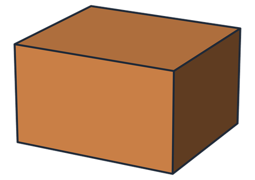
    
<strong>Cake</strong> Roughly similar size in all three dimensions.

  

  

    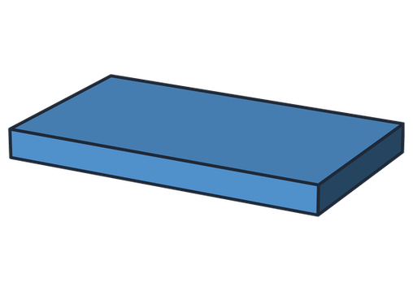
    
<strong>Pancake</strong> Broad in two dimensions, thinner in the third.

  

  

    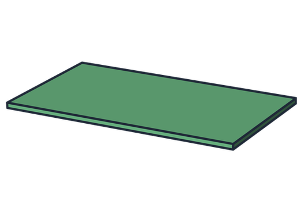
    
<strong>Rice paper</strong> Effectively 2D (very little depth information).

  

## Parametric / Direct Transforms

  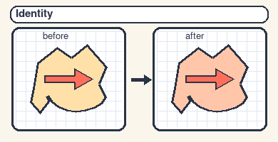
  

    <h3>No transform (<a href="api_transforms.html#castalign.base.Identity"><code>Identity</code></a>)</h3>
    
<strong>What it does:</strong> No-op transform.

    
<strong>Parameters/defaults:</strong> none.

    
<strong>Geometry:</strong> Cake, Pancake, Rice paper.

    

      
      
      
    

  

  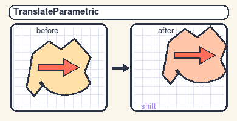
  

    <h3>Translate (<a href="api_transforms.html#castalign.base.TranslateParametric"><code>TranslateParametric</code></a>)</h3>
    
<strong>What it does:</strong> Direct z/y/x translation.

    
<strong>Parameters/defaults:</strong> <code>z=0.0</code>, <code>y=0.0</code>, <code>x=0.0</code>.

    
<strong>Geometry:</strong> Cake, Pancake, Rice paper.

    

      
      
      
    

  

  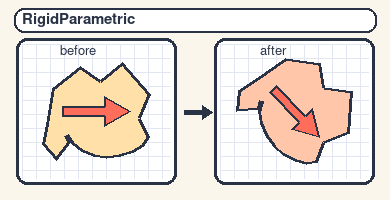
  

    <h3>Rigid (<a href="api_transforms.html#castalign.base.RigidParametric"><code>RigidParametric</code></a>)</h3>
    
<strong>What it does:</strong> Direct translation + Euler-angle rotation.

    
<strong>Parameters/defaults:</strong> <code>z=0.0</code>, <code>y=0.0</code>, <code>x=0.0</code>, <code>zrotate=0.0</code>, <code>yrotate=0.0</code>, <code>xrotate=0.0</code>, <code>invert=False</code>.

    
<strong>Geometry:</strong> Cake, Pancake, Rice paper.

    

      
      
      
    

  

  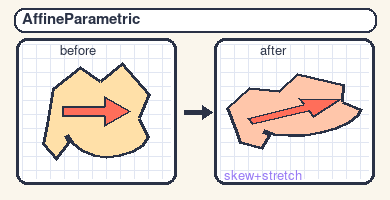
  

    <h3>Affine (<a href="api_transforms.html#castalign.base.AffineParametric"><code>AffineParametric</code></a>)</h3>
    
<strong>What it does:</strong> Direct translation + rotation + scale + shear affine map.

    
<strong>Parameters/defaults:</strong> <code>z=0.0</code>, <code>y=0.0</code>, <code>x=0.0</code>, <code>zrotate=0.0</code>, <code>yrotate=0.0</code>, <code>xrotate=0.0</code>, <code>zscale=1.0</code>, <code>yscale=1.0</code>, <code>xscale=1.0</code>, <code>yzshear=0.0</code>, <code>xzshear=0.0</code>, <code>xyshear=0.0</code>, <code>invert=False</code>.

    
<strong>Geometry:</strong> Cake, Pancake†.

    

      
      
    

  

  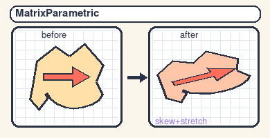
  

    <h3>Transformation matrix (<a href="api_transforms.html#castalign.base.MatrixParametric"><code>MatrixParametric</code></a>)</h3>
    
<strong>What it does:</strong> Direct 3x3 matrix + translation entry.

    
<strong>Parameters/defaults:</strong> <code>a11=1</code>, <code>a12=0</code>, <code>a13=0</code>, <code>a21=0</code>, <code>a22=1</code>, <code>a23=0</code>, <code>a31=0</code>, <code>a32=0</code>, <code>a33=1</code>, <code>z=0</code>, <code>y=0</code>, <code>x=0</code>.

    
<strong>Geometry:</strong> Cake, Pancake, Rice paper.

    

      
      
      
    

  

  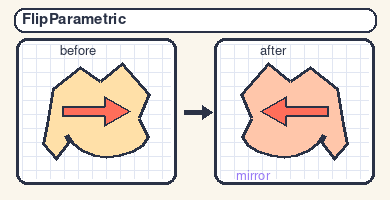
  

    <h3>Flip (<a href="api_transforms.html#castalign.base.FlipParametric"><code>FlipParametric</code></a>)</h3>
    
<strong>What it does:</strong> Flip one or more axes.

    
<strong>Parameters/defaults:</strong> <code>z=False</code>, <code>y=False</code>, <code>x=False</code>, <code>zthickness=0</code>, <code>ythickness=0</code>, <code>xthickness=0</code>.

    
<strong>Geometry:</strong> Cake, Pancake, Rice paper.

    

      
      
      
    

  

  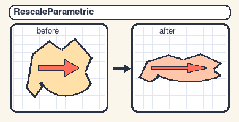
  

    <h3>Rescale (<a href="api_transforms.html#castalign.base.RescaleParametric"><code>RescaleParametric</code></a>)</h3>
    
<strong>What it does:</strong> Axis-wise scaling.

    
<strong>Parameters/defaults:</strong> <code>z=1.0</code>, <code>y=1.0</code>, <code>x=1.0</code>.

    
<strong>Geometry:</strong> Cake, Pancake, Rice paper.

    

      
      
      
    

  

## Point-based Transforms

  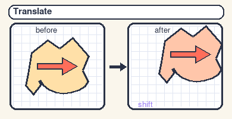
  

    <h3>Translate (<a href="api_transforms.html#castalign.base.Translate"><code>Translate</code></a>)</h3>
    
<strong>What it does:</strong> Best-fit translation from matched points.

    
<strong>Parameters/defaults:</strong> <code>invert=False</code>.

    
<strong>Geometry:</strong> Cake, Pancake, Rice paper.

    

      
      
      
    

  

  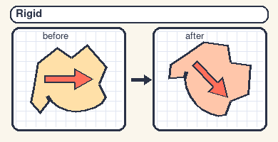
  

    <h3>Rigid (<a href="api_transforms.html#castalign.base.Rigid"><code>Rigid</code></a>)</h3>
    
<strong>What it does:</strong> Best-fit rotation + translation from matched points.

    
<strong>Parameters/defaults:</strong> <code>invert=False</code>.

    
<strong>Geometry:</strong> Cake, Pancake, Rice paper.

    

      
      
      
    

  

  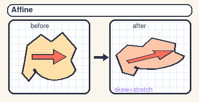
  

    <h3>Affine (<a href="api_transforms.html#castalign.base.Affine"><code>Affine</code></a>)</h3>
    
<strong>What it does:</strong> Best-fit full affine map from matched points.

    
<strong>Parameters/defaults:</strong> <code>invert=False</code>.

    
<strong>Geometry:</strong> Cake, Pancake†.

    

      
      
    

  

  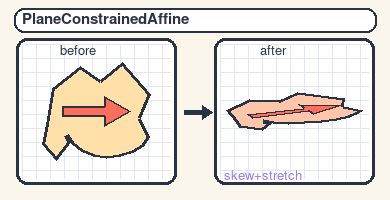
  

    <h3>Laminar affine (<a href="api_transforms.html#castalign.base.LaminarAffine"><code>LaminarAffine</code></a>)</h3>
    
<strong>What it does:</strong> Affine fit in a dominant laminar plane with separate normal-depth handling.

    
<strong>Parameters/defaults:</strong> <code>invert=False</code>.

    
<strong>Geometry:</strong> Pancake, Rice paper.

    

      
      
    

  

  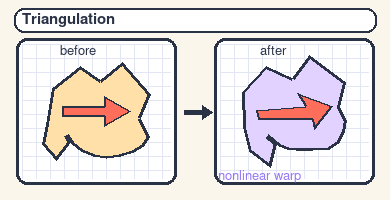
  

    <h3>Nonlinear 3D triangulation (<a href="api_transforms.html#castalign.base.Triangulation"><code>Triangulation</code></a>)</h3>
    
<strong>What it does:</strong> Nonlinear piecewise-affine warp from tetrahedral triangulation.

    
<strong>Parameters/defaults:</strong> <code>invert=True</code>.

    
<strong>Geometry:</strong> Cake.

    

      
    

  

  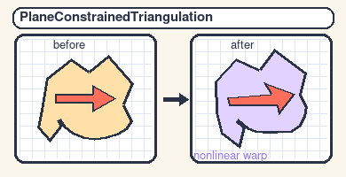
  

    <h3>Laminar triangulation (<a href="api_transforms.html#castalign.base.LaminarTriangulation"><code>LaminarTriangulation</code></a>)</h3>
    
<strong>What it does:</strong> Nonlinear triangulation warp in a fitted laminar plane in 3D.

    
<strong>Parameters/defaults:</strong> <code>invert=True</code>, <code>normal_z=0.0</code>, <code>normal_y=0.0</code>, <code>normal_x=0.0</code>.

    
<strong>Geometry:</strong> Pancake, Rice paper‡.

    

      
      
    

  

† For pancake data, full affine can work well but needs well-distributed point matches across depth/corners to avoid shear-dominant fits.

‡ For rice-paper-like data, performance is usually best when the rice-paper image is the target image.
