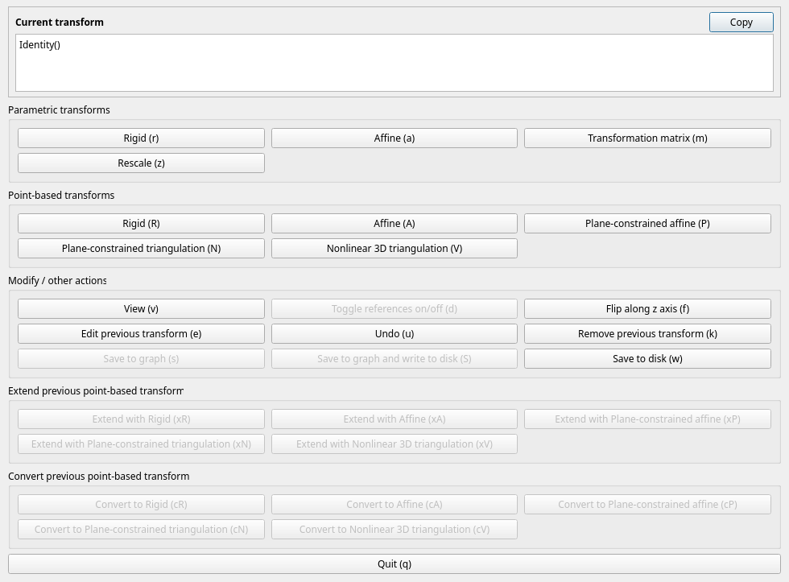
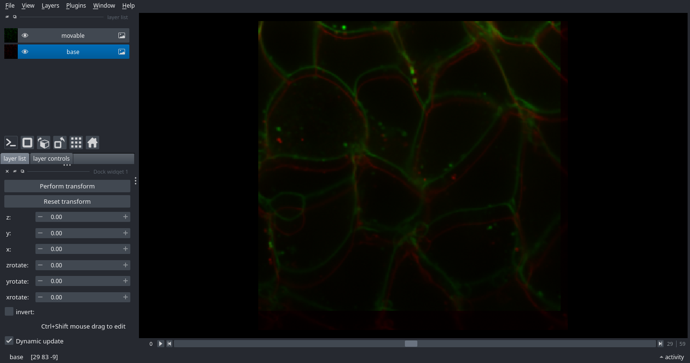
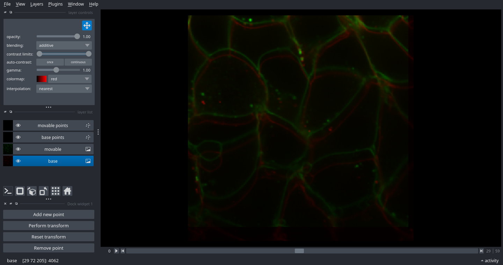

# Tutorial

## Conceptual summary

There are three main components:

1. **<a href="api_transforms.html">Transforms</a>**.  A transform allows you to get from an input space to a target
   space through affine or nonlinear transforms.  It allows you to pass points
   or images from the input space to the target space.  For instance, a rotation
   matrix with a shift is an example of a <a href="api_transforms.html#castalign.base.Transform">Transform</a>.  There are many included by
   default, but you can also create your own.  Transforms can be composed and
   edited.  Transforms are the foundation of this library.
2. **GUIs to create transforms**.  It can be difficult to find the correct
   parameters for a transform, so multiple GUIs can assist you.  The simplest
   one (<a href="api_gui.html#castalign.gui.alignment_gui"><code>alignment_gui()</code></a>) allows you to pass two volumes and a Transform,
   and then interactively use that Transform to align the volumes.  A more
   advanced one (<a href="api_gui.html#castalign.gui.align_interactive"><code>align_interactive()</code></a>) allows you to align in steps by
   composing different transforms together.
3. **<a href="api_graphs.html">Graphs</a> to manage networks of transforms**.  In many practical applications,
   you may need to align many different images to the same target image, or
   other complex relationships between images.  It can quickly become unwieldly
   to organise all of these transforms and their corresponding images.  <a href="api_graphs.html">Graphs</a>
   make it easy to keep everything organised.  Several convenience methods are
   included for aligning within a graph.

CASTalign always uses (z,y,x) coordinate format.  Likewise, images are
expected to have the z position as its first coordinate, y as its second, and x
as its third.  The point (5,6,7) on an image ``im`` will be at the voxel
``im[5,6,7]``.  Note that when displaying images, as is the convention in
Python, the origin is shown at the top left of the screen, and positive y values
indicate closer to the bottom of the screen.  This format is compatible with
nearly all other Python image libraries, and so usually you should not need to
think about this.

CASTalign also uses an extension on numpy ndarrays to specify a coordinate
system origin.  These objects are called "<a href="api_shifted_arrays.html#castalign.ndarray_shifted.ndarray_shifted">ndarray_shifted</a>".  If you do not care
about the shift, you can use them like a normal numpy array.

## Transforms

A *<a href="api_transforms.html#castalign.base.Transform">Transform</a>* takes you from one coordinate space (the input space) to another
coordinate space (the target space).  The input is the "movable" image and the
target is the "base".  For instance, suppose you have a volumetric image , and a
second volumetric image rescaled to have uniform voxel size of 1um.  A Transform
could map points or images between the raw and rescaled coordinate spaces.

There are many types of transforms included by default.  These fall into two
main categories:

- *Parameter-based Transforms* use parametric values to define the Transform.
  For instance, <a href="api_transforms.html#castalign.base.TranslateParametric">TranslateParametric</a> is a parameter-based transform that receives an
  explicit z, y, and x shift.
- *Point-based Transforms* use a point cloud to define the Transform.  For
  point-based transforms, you must define the starting and ending positions of
  several keypoints.  For instance, a <a href="api_transforms.html#castalign.base.Translate">Translate</a> will find the z, y, and x
  shifts that best fit the keypoints.  You can choose these keypoints from a
  gui.  Some point-based transforms may also include parameters, such as a
  smoothness hyperparameter or a normal vector along which the Transform should
  occur.

**Transforms are invertible.**  You can use the <a href="api_transforms.html#castalign.base.Transform.invert"><code>Transform.invert()</code></a> function to perform
the inversion.  This occurs analytically for most transforms.

**Transforms may be specified or unspecified.**  A specified Transform includes
values for each of its parameters, and matching point clouds if it is a
Point-based Transform.  This is represented by an instance of the class.  An
unspecified Transform does not yet have chosen parameters or points, and is
represented by the uninsantiated class.  For instance,
``TranslateParametric(x=3,y=0,z=1)`` is specified, but ``TranslateParametric`` is
unspecified.  You cannot apply an unspecified Transform to points or an image,
because you have not yet defined what the transform should do.  Unspecified
transforms can be made specified through the GUI, or by calling them with the
appropriate parameters.

**Transforms are composable.**  If you have two transforms, you can add them
together to get their composition.  For instance, the Transform that first
applies Transform A and then applied Transform B can be written in Python as
`A + B`. Two specified transforms may be composed, and their composition gives
another specified Transform.  A specified and unspecified Transform may also be
composed, but their composition gives an unspecified transform.  Currently, the
unspecified Transform must be the final term in the sum.  Two unspecified
transforms cannot be composed.

**Transforms are lossless.**  If you compose 
``RescaleParametric(x=.5, y=.5, z=.5) + RescaleParametric(x=2, y=2, z=2)`` 
and apply it to an image, the result will be identical
to your starting image, without the artifacts from resizing the image.  More
generally, under the hood, a long chain of composed transforms will all be
applied at once.

**All the information needed to save a Transform comes from its text
representation.**  So, you can simply call "print" and then copy and paste it
somewhere, or save the text of the Transform to a text file.  The string
representation is executable Python code that you can run to recreate your
Transform.  Nevertheless, there is also a <a href="api_transforms.html#castalign.base.Transform.save"><code>Transform.save()</code></a>
function which does this for you.

### List of Transforms

Different transforms are useful for different types of data.  For different
geometries of input (movable) images, different transforms may be advantageous.
Input images can be approximately one of three types:

- *Cake*: Approximately equally thick in all three dimensions.  For example, a
  three-dimensional z-stack.
- *Pancake*: Wide in two dimension, and somewhat thin (but not too thin) in the
  third dimension. For example, a histology section may be 10 mm in length and
  width, but only 0.1 mm in depth.
- *Rice paper*: A two-dimensional image, where the third dimension contains no
  useful information or does not exist at all (e.g. only one voxel thick). For
  example, a two-dimensional imaging plane.

transforms may be affine (linear) or non-linear.  Affine transforms, under the
hood, use the equation ``points @ self.matrix + self.shift`` to transform
points.

While creating your own Transform is easy, the following transforms are included
by default:

See also the [Transforms Gallery](transforms_gallery) for visual examples and parameter/default summaries.

| Name | Cake | Pancake | Rice paper | Point-based | Affine |
|------|------|---------|------------|-------------|--------|
| <a href="api_transforms.html#castalign.base.Identity">Identity</a> | X | X | X |  | X |
| <a href="api_transforms.html#castalign.base.Translate">Translate</a> | X | X | X | X | X |
| <a href="api_transforms.html#castalign.base.TranslateParametric">TranslateParametric</a> | X | X | X |  | X |
| <a href="api_transforms.html#castalign.base.Rigid">Rigid</a> | X | X | X | X | X |
| <a href="api_transforms.html#castalign.base.RigidParametric">RigidParametric</a> | X | X | X |  | X |
| <a href="api_transforms.html#castalign.base.Affine">Affine</a> | X | † |  | X | X |
| <a href="api_transforms.html#castalign.base.AffineParametric">AffineParametric</a> | X | † |  |  | X |
| <a href="api_transforms.html#castalign.base.PlaneConstrainedAffine">PlaneConstrainedAffine</a> |  | X | X | X | X |
| <a href="api_transforms.html#castalign.base.FlipParametric">FlipParametric</a> | X | X | X |  | X |
| <a href="api_transforms.html#castalign.base.MatrixParametric">MatrixParametric</a> | X | X | X |  | X |
| <a href="api_transforms.html#castalign.base.RescaleParametric">RescaleParametric</a> | X | X | X |  | X |
| <a href="api_transforms.html#castalign.base.Triangulation">Triangulation</a> | X |  |  | X |  |
| <a href="api_transforms.html#castalign.base.PlaneConstrainedTriangulation">PlaneConstrainedTriangulation</a> |  | X | ‡ | X |  |


† It is possible to do a successful <a href="api_transforms.html#castalign.base.Affine">Affine</a> with a pancake
geometry, but make sure to match at least one point at the top and bottom near
each of the four corners.  Otherwise, shear effects will dominate the transform.

‡ When using <a href="api_transforms.html#castalign.base.PlaneConstrainedTriangulation">PlaneConstrainedTriangulation</a> with a movable image that has a rice paper
geometry, it is generally more effective to set the rice paper image as the
target image when performing the alignment.

### Using a Transform

There are two important methods:

- <a href="api_transforms.html#castalign.base.Transform.transform"><code>Transform.transform(points)</code></a> will apply the transform to either a single
  point, or to a list of points.  If ``points`` is a matrix, there should be
  three columns, corresponding to z, y, and x.
- <a href="api_transforms.html#castalign.base.Transform.transform_image"><code>Transform.transform_image(im)</code></a> will apply the transform to an image.  There
  are more arguments controlling how the image is generated, see the function
  documentation for more information.  The transformed image this function
  returns will be an "<a href="api_shifted_arrays.html#castalign.ndarray_shifted.ndarray_shifted">ndarray_shifted</a>", so if you plot it outside of the
  Transform library, it may not appear to be aligned unless you shift it by the
  position of the origin.  See the function documentation for more information.

There is also a shorthand way to apply transforms.  You can call a transform
like a function: if the input looks like points, it uses
<a href="api_transforms.html#castalign.base.Transform.transform"><code>transform()</code></a>, and otherwise it uses
<a href="api_transforms.html#castalign.base.Transform.transform_image"><code>transform_image()</code></a>.

```python
p_out = t([10, 20, 30])        # Same as t.transform([10, 20, 30])
img_out = t(img1)              # Same as t.transform_image(img1)
```

### Examples

As a simple example, let's consider <a href="api_transforms.html#castalign.base.TranslateParametric">TranslateParametric</a>.  Here we show how to
transform points, as well as perform a composition of two transforms.

``` python
import numpy as np
import castalign as ca

# Example 1
t1 = ca.TranslateParametric(x=3, y=4, z=5)
assert np.all(t1.transform([10, 20, 30]) == [15, 24, 33])
assert np.all(t1.transform([[10, 20, 30], [40, 50, 60]]) == [[15, 24, 33], [45, 54, 63]])

# Example 2
t2 = ca.TranslateParametric(z=1, y=1, x=1)
t = t1 + t2
assert np.all(t.transform([10, 20, 30]) == [16, 25, 34])

# Example 3
t = t1 + ca.Identity()
assert np.all(t.transform([10, 20, 30]) == t1.transform([10, 20, 30]))
```

To transform an image, e.g., applying a rotation and a translation:

``` python
# Load example data
from skimage.data import cells3d
im = cells3d()[:,1]

# Define the Transform and apply it to the image
import castalign as ca
t = ca.RigidParametric(zrotate=30, x=60)
im_rotate = t.transform_image(im)

# Visualise the result
import napari
v = napari.Viewer()
v.add_image(im, blending="additive", colormap="Green")
v.add_image(im_rotate, translate=im_rotate.origin, blending="additive", colormap="Red")
```

We will show examples of point-based transforms once we explore the GUI.

## GUI

This library contains a GUI based on Napari that can be used to fit transforms
by hand, seeing the changes interactively as the Transform is edited.  There are
two primary interactive functionalities of the GUI:

- Adjusting Transform parameters
- Selecting points for point-based transforms

There are two ways to access the GUI.  The first, using the function
<a href="api_gui.html#castalign.gui.alignment_gui"><code>alignment_gui()</code></a>, allows you to create or edit a single Transform.  If you
pass it an unspecified Transform, it will create a new specified Transform.  If
you pass it a specified transform, it will allow you to edit it.

The second function is <a href="api_gui.html#castalign.gui.align_interactive"><code>align_interactive()</code></a>, which allows you to create
chains of composed transforms.  For example, it is often useful to perform a
manual translation or rotation before selecting keypoints for a point-based
transform, because it makes it easier to find the matching keypoints in both
images.  Usually, this is the one you want to use.

### Creating and editing transforms with the GUI

Let's use the <a
href="api_gui.html#castalign.gui.align_interactive"><code>align_interactive()</code></a>
GUI, designed for selecting, editing, and chaining together transforms.  Let's
see how we align two volumetric images.

```python
# First create some dummy data for us to align
import skimage
fixed = skimage.data.cells3d()[:, 0]
movable = skimage.transform.resize(fixed[3:,5:,:-2], (60, 240, 250))

# Now import CASTalign.  We need to iImport the GUI separately, 
# since CASTalign can be used on computers without GUIs.
import castalign as ca
import castalign.gui 

t = ca.gui.align_interactive(movable, fixed)

print(t)
```

The GUI will look like this:



On the top row, we can see see the current transform, which is just Identity()
for now (i.e., no transform).  The next section shows parametric transforms,
followed by point-based transforms, other tools, and then two options to modify
poinst-based transforms.

### Parametric transforms

Let's start with a parametric transform.  "Rigid" (RigidParametric) is usually a
good place to start.  Click the "Rigid" button under the "Parametric Transforms"
section.

We see a GUI come up that looks like this:



In the centre, we see two images that are not quite aligned with each other.  On
the bottom left, we see several options for parameters that can specify a rigid
transformation.

First, let's try to align these by eye.  Hold Ctrl+Shift, and then click and
drag the image in the viewport while continuing to hold down Ctrl+Shift.  You
should be able to drag and drop this image.

Now, look down at the bottom left side of the screen.  The textbox sliders for
x, y, and z should have changed.  You can try changing these sliders and see
that the position of the green image in the viewport moves, while the red image
stays the same.

You will see it is hard to get them to be exactly the same.  Move them to be
somewhat close, and then get out of the interface by clicking the X button in
the corner.

### Point-based transforms

The GUI window to select a transform should appear again.  This time, select
"Rigid" under the "Point-based Transforms" section.



You will see a window that looks similar to the one we saw earlier, except this
time, there will be buttons on the bottom left instead of text box sliders.
This is the interface for adding corresponding points between the two images.

To add a new point, click on "Add new point".  The movable image with
temporarily become faded out, and you can choose a point in the base image.
Left clicking will select the point underneath the cursor, and right clicking
will find the nearest intensity peak; in other words, if you click near a bright
spot, it will find the centre of the bright spot.  After clicking, the
background image will fade out and you can select a point on the movable image
using the same mechanism.  To remove a point, click "Remove point" and then
click nearby the point you would like to remove; both points in the pair will be
removed.

Once you have added a few points this way, you can click the "Perform transform"
button.  This will fit the transform and readjust the display.  If you click
"Reset transform", it will undo the transform, but keep the selected points.

When you have finished adding points, and are satisfied with the transform,
close out of the viewer by clicking the X in the corner.  The current active
transform will be added to the transform chain.  Note that the currently
displayed transform is the one that is added; if you have clicked reset
transform, no transform will be saved, or have not clicked "Perform transform"
since adding points, the new points added since clicking it will not be saved.

Each additional transform added through the interface is added to the chain.

### Changing the last transform in the chain

Notice that the Rigid transform does not provide a good fit to the images.
(This is by design, since we rescaled the image when constructing it.)  If you
notice that the transform you selected points for is inapproriate, you can
convert the points from the previous transform into a different transform.  In
the GUI, notice that the buttons towards the bottom, which were previously
greyed out, are now clickable.  This is because your most recent transform was
point-based.

Click the "Convert to Affine" button at the bottom of the transform selection
dialog.  A viewer will come up, which will be just like the point-based viewer
and will have all of the same points selected, but the transform will be an
Affine transform instead of a Rigid transform.  If it looks okay, you can close
out to accept, otherwise, you can add more points.

The "Extend" buttons near the "Convert" buttons work similarly, except instead
of replacing the old transform, they use the _errors_ of the previous
point-based transform as a starting point for a new transform.  The primary use
of this is to use a point-based transform immediately followed by a non-linear
transform.

### Saving transforms

There are three ways that the GUI makes transform chains available.  The first
is by returning the transform as the return value of the "align_interactive"
function.  In this way, if can be incorporated into Python scripts.

Second, the transform can be saved directly by using the "Save transform"
button.  This will open a dialog box to save.  Then, it can be loaded with:

```python
t = pixease.load("/path/to/transform.tf")
```

The third is by saving to a graph, which we will discuss in the next section....

## <a href="api_graphs.html">Graphs</a>

With most real-world data, many transforms are needed, and all of these
transforms relate to each other.  It quickly becomes difficult to keep track of
which transform maps which space to which other space.  A
<a href="api_graphs.html#castalign.graph.Graph">Graph</a> is how CASTalign organises this.

A Graph stores named spaces as nodes, and transforms between spaces as edges.
You can also attach images directly to nodes.  This is useful for GUI-driven
workflows, because you can align by node name instead of repeatedly passing raw
arrays.

To create a node, use
<a href="api_graphs.html#castalign.graph.Graph.add_node"><code>g.add_node(name, image=...)</code></a>.
To define a transform between nodes, use
<a href="api_graphs.html#castalign.graph.Graph.add_edge"><code>g.add_edge(node1, node2, tform)</code></a>.
As elsewhere in CASTalign, this follows a "from -> to" convention:
``tform`` maps from ``node1`` into ``node2``.

Graphs also support shorthand indexing, which is equivalent to the explicit
methods above:

```python
g["img1"] = img1                # Same as g.add_node("img1", image=img1)
g["img1":"img2"] = t            # Same as g.add_edge("img1", "img2", t)

img1_loaded = g["img1"]         # Same as g.get_image("img1")
t_img12 = g["img1":"img2"]      # Same as g.get_transform("img1", "img2")

"img1" in g                     # Node existence check
("img1", "img2") in g           # Edge existence check
del g["img1":"img2"]            # Same as g.remove_edge("img1", "img2")
```

### Example workflow with three images

Suppose from the previous section you already have ``fixed``, ``movable``, and
a transform ``t`` returned by ``align_interactive(movable, fixed)``.

```python
img3 = img2[:,10:,:-15] # Simple translation of img2

g = ca.Graph()
g["img1"] = movable
g["img2"] = fixed
g["img3"] = img3

# Existing alignment from earlier:
g["img1":"img2"] = t
```

Now align ``img2`` to ``img3`` in the interactive GUI:

```python
t_img23 = castalign.gui.align_interactive("img2", "img3", graph=g)

# In the GUI, click "Save to graph" (or "Save to graph and write to disk")
# to store this edge directly in the graph.
```

If you close the GUI without saving, you can still add that edge manually:

```python
g["img2":"img3"] = t_img23
```

### Getting transforms across indirect paths

There is no direct ``img1 -> img3`` alignment in this example, but Graph will
compose the path ``img1 -> img2 -> img3`` automatically:

```python
t_img13 = g["img1":"img3"]
img1 = g["img1"]
img1_like_img3 = t_img13(img1, output_size=img3.shape)
```

In this case, there is only one path, but in the more general case, CASTalign
will find the shortest path between the two nodes and compose the necessary
transforms to map from one space to the other.

### Viewing all images in one coordinate system

<a href="api_gui.html#castalign.gui.GraphViewer"><code>GraphViewer</code></a> lets you display graph images in a shared space.  Here,
everything is shown in ``img1`` coordinates:

```python
v = castalign.gui.GraphViewer(graph=g, space="img1")
v.add_image("img1", name="img1 (base)")
v.add_image("img2", name="img2 -> img1", blending="additive", opacity=0.6)
v.add_image("img3", name="img3 -> img1", blending="additive", opacity=0.6)
```

To inspect graph structure itself, run
<a href="api_graphs.html#castalign.graph.Graph.visualise"><code>g.visualise()</code></a>.

### <a href="api_shifted_arrays.html#castalign.ndarray_shifted.ndarray_shifted">ndarray_shifted</a>

Normally you should not encounter <a href="api_shifted_arrays.html#castalign.ndarray_shifted.ndarray_shifted">ndarray_shifted</a> objects.  This is an internal data
storage which adds a origin offset to an NDArray.  This allows efficient
representation and modification of images which undergoes translation relative
to another image.

In day-to-day use, you can treat this like a normal numpy array most of the
time.

Practical tips:

- If an image looks offset when you plot it, use ``img.origin`` as the display
  translation (for example in napari).
- If another library expects a plain ndarray, use ``np.asarray(img)``.
- If you need to convert between absolute coordinates and voxel indices, use
  <a href="api_utilities.html#castalign.utils.absolute_coords_to_voxel_coords"><code>absolute_coords_to_voxel_coords()</code></a>
  and
  <a href="api_utilities.html#castalign.utils.voxel_coords_to_absolute_coords"><code>voxel_coords_to_absolute_coords()</code></a>.
